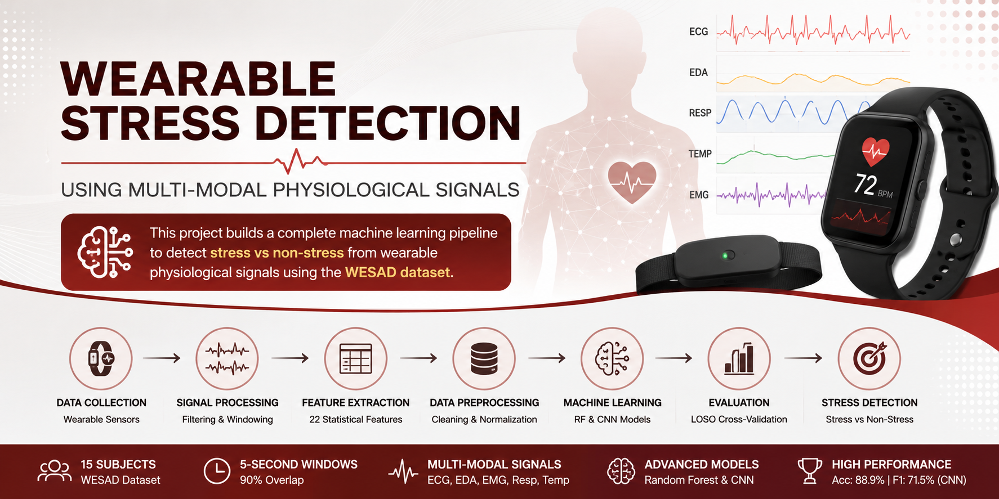
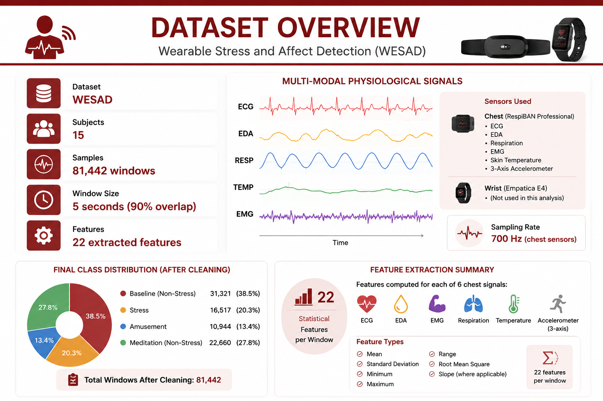
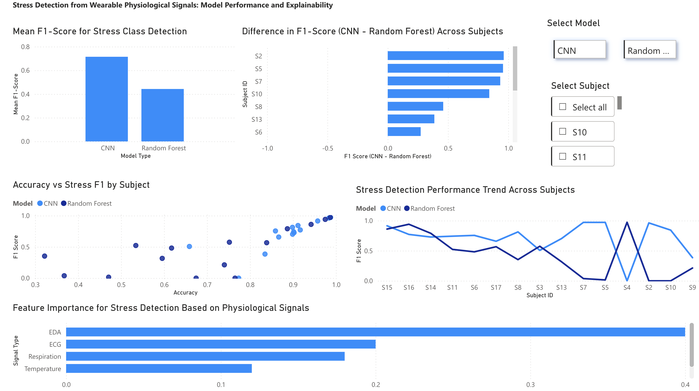
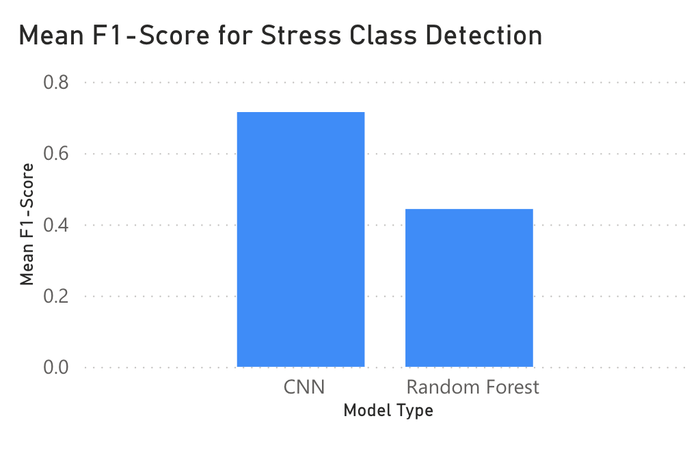
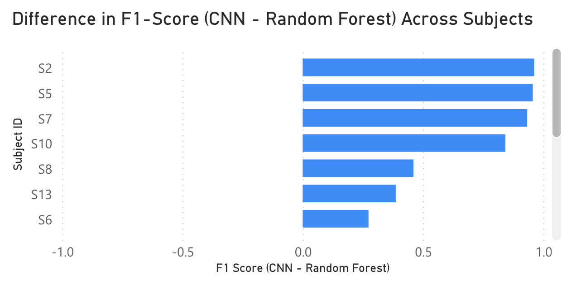
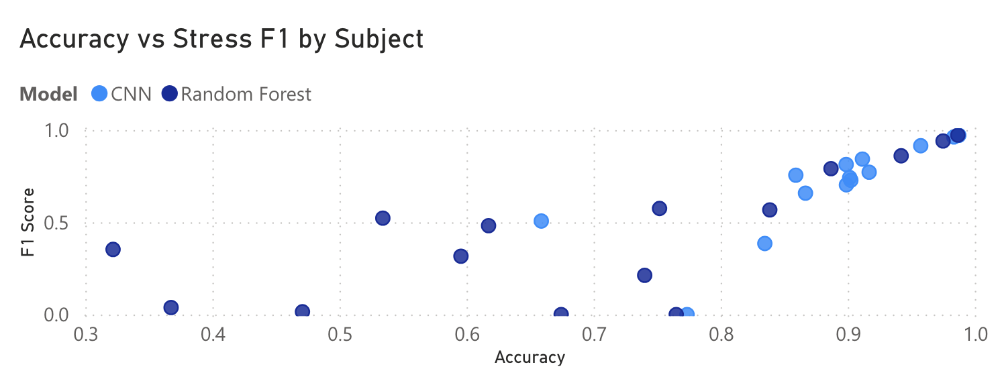
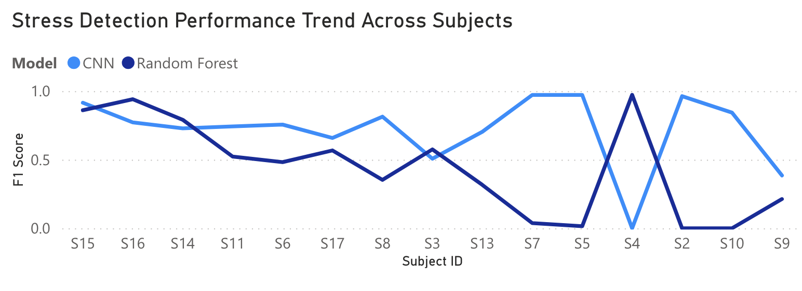
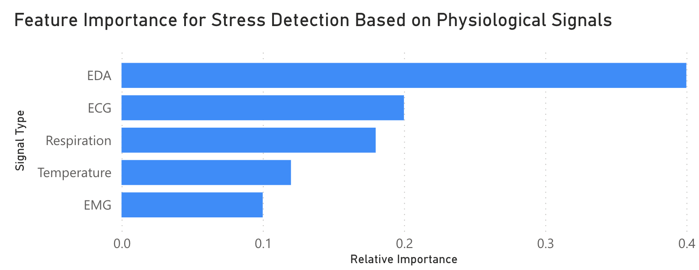
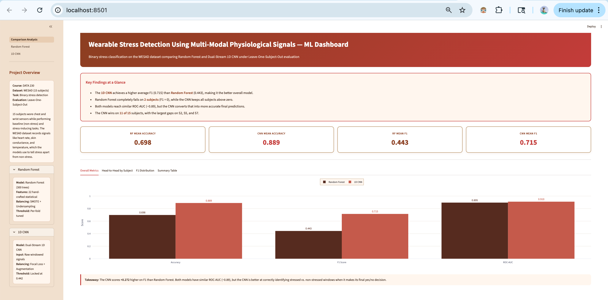

# 🧠 Wearable Stress Detection Using Multi-Modal Physiological Signals



This project builds a complete machine learning pipeline to detect **stress vs non-stress** from wearable physiological signals using the WESAD dataset.

---

## 🚀 Project Overview

Wearable sensors generate high-frequency physiological signals such as ECG, EDA, and respiration. This project converts raw signals into meaningful stress predictions using machine learning and deep learning models.

---

## 📊 Dataset Summary



- **Dataset:** WESAD
- **Subjects:** 15
- **Samples:** 81,442 windows
- **Window Size:** 5 seconds (90% overlap)
- **Features:** 22 extracted features

---

## ⚙️ Pipeline Overview


1. Sliding Window Feature Extraction
2. Outlier Removal (Z-score filtering)
3. Feature Normalization
4. Model Training (RF + CNN)
5. Evaluation using LOSO

---

## 🤖 Machine Learning Models

### 🔹 Random Forest
- Accuracy: **84.56%**
- F1 (Stress): **72.34%**
- Interpretable model

### 🔹 1D CNN
- Accuracy: **88.9%**
- F1 (Stress): **71.5%**
- Learns complex temporal patterns

---

## 📈 Power BI Dashboard

### 📌 Dashboard Overview


---

### 🔶 Mean F1 Score (Stress Detection)


> CNN achieves higher stress detection performance than Random Forest.

---

### 🔶 Subject-Level Performance Difference


> CNN outperforms Random Forest for most subjects, but performance varies across individuals.

---

### 🔶 Accuracy vs F1 (Imbalance Insight)


> High accuracy does not guarantee good stress detection due to class imbalance.

---

### 🔶 Stress Detection Across Subjects


> Performance varies across subjects, highlighting inter-subject variability.

---

### 🔶 Feature Importance (Explainability)


> Electrodermal Activity (EDA) is the strongest indicator of stress.

---

## 📊 Tableau Dashboard


- EDA distribution across conditions
- Stress vs non-stress patterns
- Interactive filtering

---

## 🌐 Streamlit Dashboard



- Model comparison
- SHAP feature importance
- Per-subject insights

---

## 🔍 Key Insights

- Stress can be detected using physiological signals
- **EDA is the most important signal**
- CNN performs better overall
- Significant **subject variability exists**
- F1-score is critical due to class imbalance

---

## ⚠️ Limitations

- Small dataset (15 subjects)
- Controlled lab environment
- Limited real-world generalization

---

## 🔮 Future Work

- Personalized stress detection models
- Real-time wearable deployment
- Larger datasets

---

## 🛠️ Tech Stack

- Python (Scikit-learn, TensorFlow)
- Streamlit
- Tableau
- Power BI
- NVIDIA RAPIDS

---

## 📁 Repository Structure

```text
Data230-Project-Stress-Detection/
│
├── assets/                                   # Images used in this README
│   ├── accuracy_f1_scatter.png
│   ├── f1_difference_subject.png
│   ├── f1_subject_trend.png
│   ├── feature_importance.png
│   ├── mean_f1_by_model.png
│   └── powerbi_overview.png
│
├── Streamlit_Dashboard/                      # Streamlit web app
│   ├── Comparison_Analysis.py                # Main app entry point
│   ├── pages/
│   │   ├── 1_Random_Forest.py                # Random Forest model page
│   │   └── 2_1D_CNN.py                       # 1D CNN model page
│   └── streamlit_*.png                       # Dashboard screenshots
│
├── WESAD_Extraction_Data_cleaning.ipynb      # Raw signal extraction & cleaning
├── WESAD_EDA.ipynb                           # Exploratory data analysis
├── WESAD_RAPIDS_EDA.ipynb                    # GPU-accelerated EDA (NVIDIA RAPIDS)
├── viz-before-cleaning.ipynb                 # Pre-cleaning visualizations
│
├── LOSO3MAY.ipynb                            # Random Forest with LOSO cross-validation
├── WESAD_Approach2_1DCNN_LOSO.ipynb          # 1D CNN with LOSO cross-validation
│
├── wesad_dashboard.py                        # Standalone dashboard script
│
├── Data230project-Tableau dashboard.twbx     # Tableau workbook
├── Data230-WESAD-PowerBIDashboard            # Power BI dashboard file
│
├── README.md
└── .gitignore
```

---

## 👥 Team

- Rachandeep Kaur
- Rishitha Gogineni
- Shraddhaben Patel
- Supriya Selvan Ganeshan

---

## ⭐ Star this repo if you found it useful!
